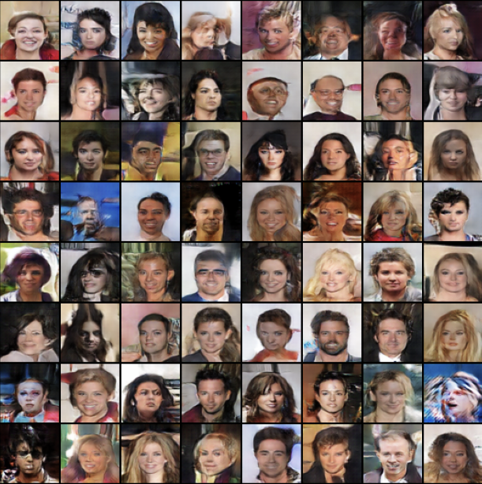

# Human-Face-Generator-DCGAN
A Deep Convolutional Generative Adversarial Network (DCGAN) that generates human faces. This project is implemented using PyTorch and trained on the [CelebA](http://mmlab.ie.cuhk.edu.hk/projects/CelebA.html) dataset.

## DCGAN
DCGAN stands for Deep Convolutional Generative Adversarial Network, it's a type of Generative Adversarial Network (GAN) used for generating new data samples with similar characteristics as the training data. It uses deep convolutional neural networks in both the generator and discriminator parts of the GAN architecture. The generator generates new samples, while the discriminator evaluates the authenticity of the generated samples by trying to distinguish them from the real training data. The two parts compete against each other, with the generator trying to produce more convincing samples, and the discriminator trying to better distinguish the fake from the real. This results in the generator gradually learning to generate more and more realistic samples. DCGANs are commonly used for generating images, videos, and audio.

## Results
The following images show the results of the DCGAN after training for 10 epochs on the CelebA dataset.

There are more generated samples in the `samples` folder. The following images are some of my favorite generated ones.

## Hardware and Software
The following hardware and software were used for training the model:
- GPU: Apple M1 Max 32-Core-GPU
- CPU: Apple M1‌ Max 10-core CPU
- RAM: 32GB SSD
- Operating System: macOS Ventura 13.1
- Python version: 3.9.15
- PyTorch version: PyTorch-Nightly 2.0.0.dev20221222

  
## Contributing
Contributions are welcome! :heart: Please open a pull request or issue for any improvements or bug fixes.
